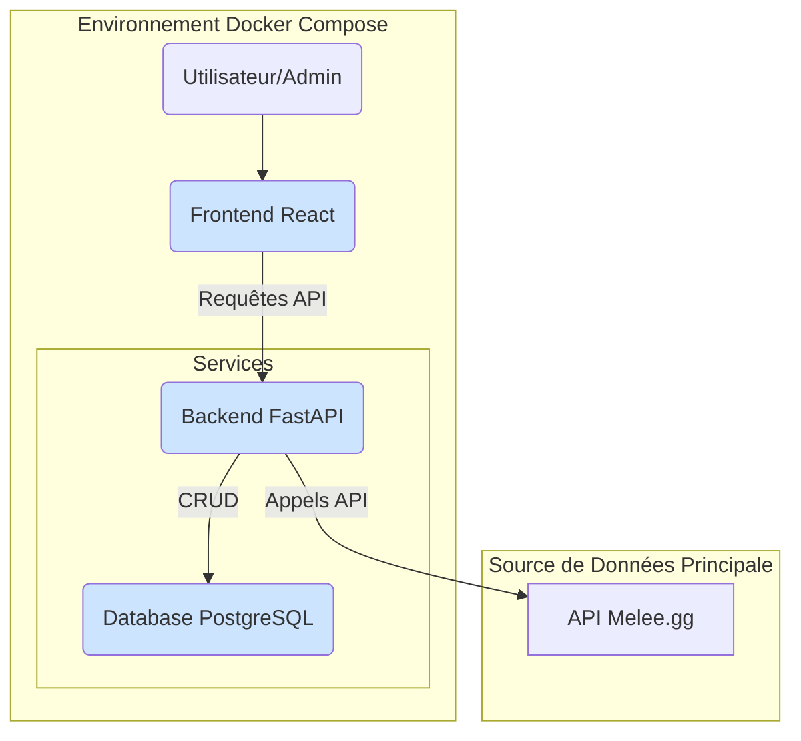

# Architecture Technique de Metalyzr (Post-Refactoring)

Ce document décrit l'architecture technique du projet Metalyzr après sa refonte majeure. L'objectif était de passer d'un prototype à une fondation applicative robuste, scalable et maintenable.

## 1. Principes Directeurs

-   **Simplicité et Robustesse** : Préférer des solutions éprouvées et simples à maintenir.
-   **Découplage** : Séparer clairement les responsabilités (backend, base de données, scraper).
-   **Reproductibilité** : L'environnement de développement doit être 100% reproductible via Docker.
-   **Pipeline de Données Clair** : Le flux de données, de la source à la base de données, doit être explicite et centralisé.

## 2. Architecture des Services

L'application est entièrement conteneurisée à l'aide de **Docker** et orchestrée par **Docker Compose**.



-   **Backend (FastAPI)** : Le cœur de l'application. C'est un service Python qui expose une API REST. Ses responsabilités sont :
    1.  Servir de point d'entrée pour le frontend.
    2.  Orchestrer le pipeline de données (ETL).
    3.  Exécuter les requêtes d'analyse sur la base de données.
-   **Database (PostgreSQL)** : La source de vérité unique. Elle stocke toutes les données de manière structurée et relationnelle.
-   **Frontend (React)** : L'interface utilisateur. Elle consomme l'API du backend pour afficher les visualisations de données et permettre les actions d'administration. *Note : pour le développement, le frontend est lancé localement et non dans Docker Compose.*

## 3. Structure du Backend

Le backend suit une architecture en couches pour une meilleure séparation des préoccupations.

```
backend/
├── main.py                # Point d'entrée de l'application FastAPI, gestion du cycle de vie.
├── api/                   # Couche d'exposition (routage HTTP).
│   └── metagame.py        # Endpoints pour le métagame (/update, /status, /analysis, ...).
├── services/              # Couche de logique métier.
│   └── metagame_service.py  # Orchestre l'ETL : appelle le client Melee.gg, classifie, charge en BDD.
├── integrations/          # Clients pour les logiques externes.
│   ├── melee_client.py         # Client pour l'API Melee.gg.
│   └── badaro_archetype_engine.py # Moteur de classification d'archétypes.
├── database.py            # Client de base de données (psycopg2) et définition du schéma.
├── Dockerfile             # Instructions pour construire l'image du backend.
└── pyproject.toml         # Gestion des dépendances avec Poetry.
```

## 4. Pipeline de Données (ETL)

Le processus d'acquisition et de traitement des données est central et entièrement piloté par le `MetagameService` en utilisant **l'API de Melee.gg**.

1.  **Extraction (Extract)** :
    -   Un appel à l'endpoint `POST /api/metagame/update` déclenche le `MetagameService`.
    -   Le service utilise son `MeleeAPIClient` interne pour appeler directement l'API de Melee.gg.
    -   Il récupère les données structurées des tournois, y compris les **listes de decks, les joueurs, les rondes et les résultats des matchs**.
2.  **Transformation (Transform)** :
    -   Pour chaque deck récupéré, le `MetagameService` fait appel au `BadaroArchetypeEngine` pour déterminer son archétype probable.
3.  **Chargement (Load)** :
    -   Le service se connecte à la base de données PostgreSQL via le `DatabaseClient`.
    -   Il insère de manière transactionnelle l'ensemble des données (tournois, decks, cartes, **matchs**) dans les tables relationnelles.

## 5. Schéma de la Base de Données

Le schéma est conçu pour permettre des requêtes analytiques performantes.

-   `tournaments` : Informations sur les tournois (nom, date, format, source).
-   `archetypes` : Liste unique des archétypes.
-   `cards` : Liste unique des cartes.
-   `decks` : Représente une decklist jouée dans un tournoi, liée à un joueur et un archétype.
-   `deck_cards` : Table de jointure qui liste les cartes (et leur quantité) pour chaque deck.
-   `matches` : **Table clé**, stocke les résultats des matchs (deck1, deck2, vainqueur) pour les analyses de winrate.

*(Pour le DDL complet, voir le fichier `backend/database.py`)*.

---
Ce document sera maintenu à jour à chaque évolution significative de l'architecture. 