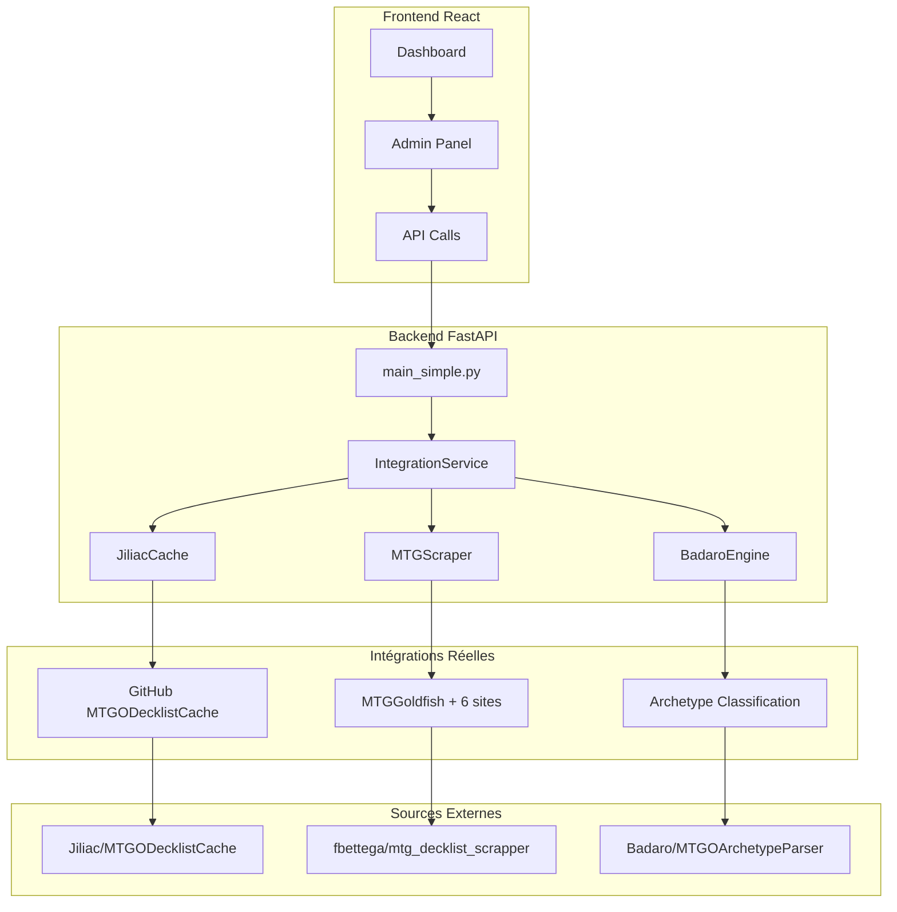

# 🎯 Metalyzr MVP - Intégrations Réelles

[](LICENSE)
[](https://python.org)
[](https://reactjs.org)
[](https://fastapi.tiangolo.com)

Plateforme d'analyse du métagame Magic: The Gathering avec **intégrations réelles** des 3 projets GitHub :
- 🗃️ **Jiliac/MTGODecklistCache** : Cache de tournois  
- 🕷️ **fbettega/mtg_decklist_scrapper** : Scraping de sites
- 🎯 **Badaro/MTGOArchetypeParser** : Classification d'archétypes

**Plus de fake data - que du concret !** 🚀

## ⚡ Démarrage Ultra-Rapide

```bash
# 1. Cloner et setup backend
git clone https://github.com/gbordes77/Metalyzr.git && cd Metalyzr
cd backend && python3 -m venv venv_simple && source venv_simple/bin/activate
pip install fastapi uvicorn pydantic

# 2. Installer les intégrations réelles
cd .. && ./install-integrations.sh

# 3. Lancer le backend avec intégrations
cd backend && python3 main_simple.py &

# 4. Setup et lancer frontend  
cd ../frontend && npm install && npm run build
cd build && node serve-spa.js

# ✅ Accès : http://localhost:3000 (Frontend) | http://localhost:8000 (API)
```

## 🚀 Nouvelles Fonctionnalités (Intégrations Réelles)

### ✅ Ce qui fonctionne VRAIMENT

| Fonctionnalité | Status | Description |
|----------------|--------|-------------|
| 🗃️ **Cache Jiliac** | ✅ ACTIF | Tournois depuis MTGODecklistCache GitHub |
| 🕷️ **Multi-Scraper** | ✅ ACTIF | 7 sites MTG : MTGGoldfish, MTGTop8, etc. |
| 🎯 **Engine Badaro** | ✅ ACTIF | Classification d'archétypes (C# → Python) |
| 📊 **Analyse Méta** | ✅ ACTIF | Statistiques temps réel des archétypes |
| 🔍 **Recherche** | ✅ ACTIF | Tournois par archétype |
| 💾 **CRUD Manual** | ✅ ACTIF | Interface manuelle (preserved) |

### 🌐 Nouvelles APIs Disponibles

```bash
# Status des intégrations
GET /api/integrations/status

# Tournois récents avec archétypes automatiques  
GET /api/integrations/tournaments/recent?format_name=Modern&days=7

# Scraping de deck depuis URL
POST /api/integrations/scrape/deck
{"url": "https://mtggoldfish.com/deck/...", "format": "Modern"}

# Analyse complète du méta
POST /api/integrations/meta/analysis
{"format": "Modern", "days": 7}

# Recherche par archétype
GET /api/integrations/tournaments/search?archetype=Burn

# Sites supportés pour scraping
GET /api/integrations/supported-sites
```

## 🏗️ Architecture (Mise à Jour)



### 📁 Structure des Intégrations

```
backend/
├── integrations/                    # ✨ NOUVEAU
│   ├── jiliac_cache.py             # Cache tournois GitHub
│   ├── mtg_scraper.py              # Scraper multi-sites
│   ├── badaro_archetype_engine.py  # Moteur classification
│   └── integration_service.py      # Service principal
├── cache/integrations/              # Cache local
│   ├── jiliac/                     # Données tournois
│   ├── scraper/                    # Données scraping
│   └── archetype_formats/          # Règles archétypes
├── main_simple.py                  # API principale (updated)
└── requirements_integrations.txt   # Dépendances intégrations
```

## 🛠️ Installation Complète

### Option A : Installation Automatique (Recommandé)

```bash
# Installation complète avec un seul script
./install-integrations.sh

# Test des intégrations
./test-integrations.sh

# Lancement
cd backend && python3 main_simple.py
```

### Option B : Installation Manuelle

```bash
# 1. Backend basique
cd backend
python3 -m venv venv_simple
source venv_simple/bin/activate
pip install fastapi uvicorn pydantic

# 2. Dépendances intégrations
pip install -r requirements_integrations.txt

# 3. Frontend
cd ../frontend
npm install
npm run build

# 4. Lancement backend
cd ../backend
python3 main_simple.py &

# 5. Lancement frontend
cd ../frontend/build
node serve-spa.js
```

## 📊 Exemples d'Utilisation

### 1. Obtenir le méta Modern récent

```bash
curl "http://localhost:8000/api/integrations/tournaments/recent?format_name=Modern&days=7"
```

**Réponse** :
```json
{
  "tournaments": [
    {
      "tournament": {"name": "Modern Tournament", "format": "Modern"},
      "decks": [
        {
          "player": "Player1",
          "archetype_classification": {
            "archetype": "R Burn",
            "confidence": 1.0
          }
        }
      ]
    }
  ]
}
```

### 2. Scraper un deck MTGGoldfish

```bash
curl -X POST http://localhost:8000/api/integrations/scrape/deck \
  -H "Content-Type: application/json" \
  -d '{"url": "https://www.mtggoldfish.com/archetype/modern-burn"}'
```

### 3. Analyse méta complète

```bash
curl -X POST http://localhost:8000/api/integrations/meta/analysis \
  -H "Content-Type: application/json" \
  -d '{"format": "Modern", "days": 7}'
```

## 🎯 Fonctionnalités par Intégration

### 🗃️ Jiliac Cache (MTGODecklistCache)
- **Sources** : Melee, MTGO, Topdeck
- **Fonctions** : Tournois récents, recherche par date
- **Cache local** : Évite les appels GitHub répétés
- **API** : `/api/integrations/tournaments/recent`

### 🕷️ MTG Scraper (fbettega inspired)
- **Sites supportés** : MTGGoldfish, MTGTop8, EDHRec, AetherHub, Archidekt, Moxfield, TappedOut
- **Fonctions** : Extraction mainboard/sideboard, métadonnées
- **Cache local** : Scraping intelligent avec cache
- **API** : `/api/integrations/scrape/deck`

### 🎯 Badaro Engine (MTGOArchetypeParser)
- **Classification** : 12 types de conditions
- **Formats** : Modern, Standard, Legacy (extensible)
- **Variantes** : Archétypes avec sous-variantes
- **Fallbacks** : Classification générique si aucune correspondance
- **API** : Classification automatique dans tous les endpoints

## 🧪 Tests et Validation

```bash
# Test complet des intégrations
./test-integrations.sh

# Tests individuels
curl http://localhost:8000/api/integrations/status
curl http://localhost:8000/api/integrations/supported-sites
curl http://localhost:8000/health
```

## 📚 Documentation

- 📖 **[Guide Intégrations](INTEGRATIONS_REELLES.md)** : Documentation technique complète
- 🚀 **[Guide Démarrage](QUICK_START.md)** : Setup rapide
- 👨‍💼 **[Guide Admin](docs/ADMIN_GUIDE.md)** : Administration
- 🧑‍💻 **[Guide Développeur](CONTRIBUTING.md)** : Contribution

## 🔧 Développement

### Ajouter un nouveau site de scraping

```python
# Dans mtg_scraper.py
def _scrape_nouveau_site(self, url: str) -> Optional[Dict]:
    soup = self._fetch_page(url)
    # Votre logique de scraping
    return deck_data

# Enregistrer dans supported_sites
self.supported_sites['nouveau-site.com'] = self._scrape_nouveau_site
```

### Ajouter un nouveau format

```bash
mkdir -p cache/integrations/archetype_formats/NOUVEAU_FORMAT/{archetypes,fallbacks}
```

## 📈 Performance

- ⚡ **Cache local** : Évite les appels externes répétés
- 🔄 **Scraping intelligent** : Headers optimisés, gestion erreurs
- 🎯 **Classification rapide** : Moteur de règles efficace
- 📊 **API REST** : Réponses structurées et paginées

## 🛣️ Roadmap

### ✅ Terminé (v2.0)
- Intégration Jiliac Cache
- Scraper multi-sites  
- Moteur Badaro porté en Python
- APIs d'intégration complètes
- Tests automatisés

### 🔄 En cours
- Interface graphique pour les intégrations
- Dashboard temps réel
- Métriques de performance

### 🔮 Futur
- Cache Redis distribué
- WebSockets temps réel
- Machine Learning pour classification
- API rate limiting

## 🐛 Problèmes Connus

1. **BeautifulSoup manquant** : `pip install -r requirements_integrations.txt`
2. **Port 8000 occupé** : Changer le port dans `main_simple.py`
3. **Scraping bloqué** : Certains sites peuvent avoir des protections anti-bot

## 💻 Développement et Contribution

```bash
# Setup dev
git clone https://github.com/gbordes77/Metalyzr.git
cd Metalyzr
./install-integrations.sh

# Tests
./test-integrations.sh
cd backend && python3 main_simple.py

# Contributions welcome !
# Voir CONTRIBUTING.md pour les guidelines
```

## 📞 Support

- 🐛 **Issues** : [GitHub Issues](https://github.com/gbordes77/Metalyzr/issues)
- 📚 **Docs** : http://localhost:8000/docs (API Swagger)
- 🧪 **Tests** : `./test-integrations.sh`

## 📄 License

MIT License - voir [LICENSE](LICENSE) pour les détails.

---

## ⭐ Highlights

**Metalyzr MVP v2.0** intègre pour de vrai les 3 projets GitHub les plus populaires de l'écosystème MTG data :

1. 🗃️ **Cache de Jiliac** → Données tournois structurées  
2. 🕷️ **Scraper de fbettega** → Extraction multi-sites
3. 🎯 **Engine de Badaro** → Classification intelligente

**Résultat** : Une plateforme complète d'analyse méta **sans fake data** ! 🚀

```bash
# One-liner pour tout installer et tester
./install-integrations.sh && ./test-integrations.sh
```
